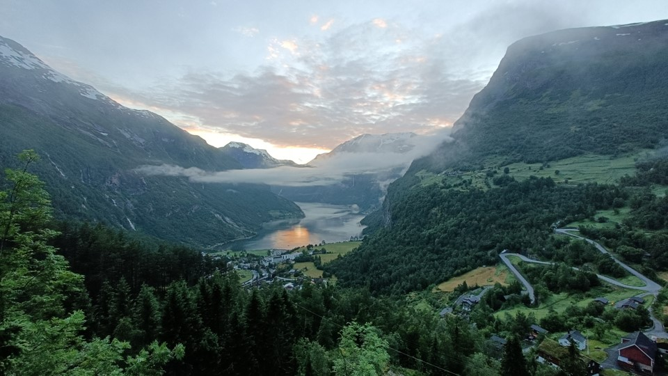

# GY4051: Earth Science and Society
___

Welcome to GY4051 Earth Science and Society. Here, you will find the module information and content, including lecture slides and reading materials.

## Module Overview
___
ECTS Credits: 6
Module Lead: Dr. Breandán Anraoi MacGabhann

### Module Aims/Objectives
Understanding of Earth Science is fundamental to Geography. This module introduces you to the key processes and materials in Earth science, and how these have influenced society. It considers the range and origin of Earth science materials, and will provide you with the skills to describe and analyse these materials and the knowledge to understand their development and meaning. Through exploration of the geological history of Ireland and beyond, you will consider the influence of geological processes and features on human geographic processes, including settlement patterns, agriculture, and economic activity.

Topics to be covered include the formation of the solar system and the Earth; the structure of the Earth and plate tectonics; igneous, metamorphic, and sedimentary rocks, minerals, and processes; environments and landscapes; the fossil record and biogeography; economic geology, including mining and petroleum geology; and geoenvironmental engineering and management.

### Module Learning Outcomes
On successful completion of this module, you will be able to: 

1. Explain the process of plate tectonics, and the formation of rocks in different tectonic settings and environments
2. Describe and identify various geological materials, using standard Earth science techniques and terminology, and interpret their origins
3. Use the principles of stratigraphy, the geologic time scale, and information from geological maps and other sources to describe the geological history of an area
4. Relate patterns in human geography to causal geological processes and features
5. Integrate information from disparate sources in earth science and human geography

## Module Schedule
___
Lectures: Mondays 0900-1100, HSG037

More info: [Title](https://)

___
[Previous](./00_template.md) | [Recommended order of tasks](./start.md#recommended-order-of-tasks) | [Next](./00_template.md)