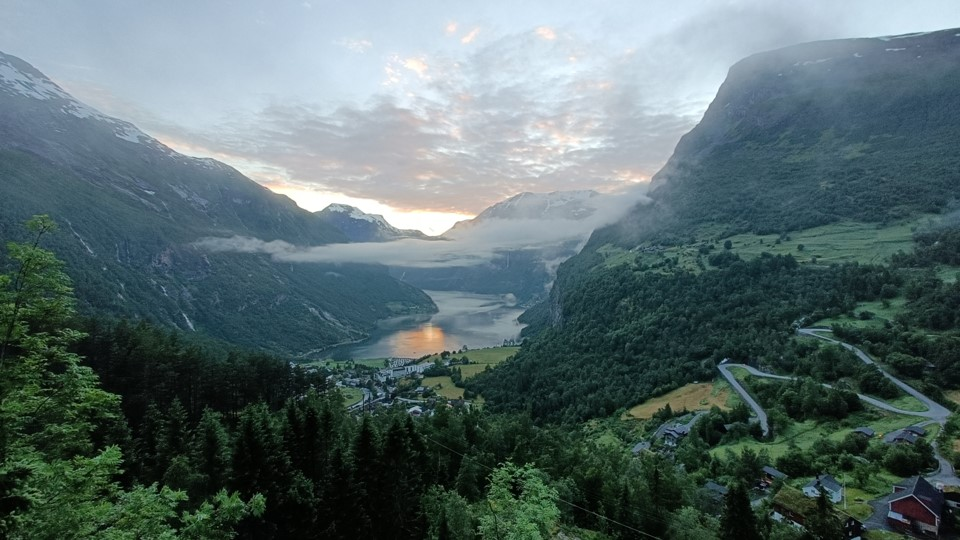

# GY4051 Labs

Watching and listening to lectures is a useful part of learning – but it’s one thing seeing photos on a screen, and a different thing completely to hold something in your hand and see it with your own eyes. That’s why this module has a strong laboratory component.

In these labs, you’ll examine 20 different rocks and 9 different sediments, with additional supporting specimens you can examine but don’t have to fully describe. You’ll be asked to observe particular features, answer questions, and think about their relevance to society. 

The intention of the labs is not to turn you into a geologist, or an expert on rock identification. The intention is that by seeing things with your own eyes, and working things out for yourself, the content you’re learning in the lectures will change from just being words to remember to actually having real meaning. 

You will have 4 2-hour lab sessions. All of the background, instructions, and questions for each of the 4 labs are contained in the GY4051 Laboratory Workbook. You can print this, and bring it to the labs; or you can use the digital copy on a laptop or tablet, and keep the answers in a notebook or the Excel spreadsheet linked below.

## Laboratory Workbook

Laboratory Workbook: [Laboratory Workbook](./assets/labs/GY4051_Lab_Workbook.pdf)

Tables and Questions in Word format: [Laboratory Exercise Questions Tables](./assets/labs/GY4051_Lab_Tables_Questions.docx)

Tables in Excel format: [Laboratory Exercise Tables](./assets/labs/GY4051_Lab_Tables.xlsx)

Geologic Time Scale online (copy in workbook): [Geologic Time Scale](https://stratigraphy.org/chart/)

Geological map of Ireland: [Geological Survey of Ireland mapviewer](https://dcenr.maps.arcgis.com/apps/MapSeries/index.html?appid=a30af518e87a4c0ab2fbde2aaac3c228)

