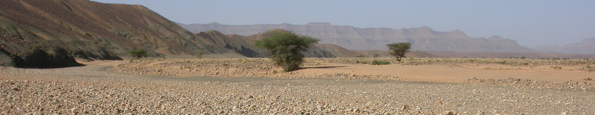

# Week 10: The Caledonian Mountains

We'll follow the stories of Laurentia, Avalonia, and the Iapetus Ocean with the history of the Caledonian mountains, an enormous mountain range which once stretched across Ireland and beyond, from what's now the Appalachian Mountains of the USA in the west, as far as Norway in the east. We'll cover how those mountains formed, and where they are now. We'll also have a change from looking at rocks to examine some sediments from different environments.

This section will contain lecture slides, the laboratory worksheet, and the assigned reading for the week. There's also a mini-virtual field trip to Valentia Island, expanding on something mentioned in the lecture - you can find that on a separate sub-page in the sidebar.

## Reading

I would like you to read Chapters 11 and 16 of Lutgens and Tarbuck 2015 *Essentials of Geology* (available as an e-book, top of the reading list - see the link in the sidebar). Chapter 11 is the chapter on Crustal Deformation and Mountain Building, and it will help you to understand what was happening during the events described in the lecture. Chapter 11 is the chapter on Deserts and Wind, and it will help you to understand what Ireland was like during the Devonian Period.

I would also like you to read Chapters 5-7 of [Understanding Earth Processes Rocks and the Geology of Ireland](https://gsi.ie/documents/UnderstandingEarth_bookmarked.pdf) by Sleeman et al. These are the chapters on Silurian rocks in Ireland, the Caledonian Orogeny, and Ireland in the Devonian Period, and so will more directly expand on what we cover in the lecture.

I would also like you to read a short paper relevant to one of the main impacts the Caledonian Orogeny is still having on society: specifically, the impacts on health. Radon gas escaping from granites (though granites are not the only source) is a significant cause of lung cancer in Ireland and around the world. This paper by [Appleton, J.D. 2007 Radon: Sources, Health Risks, and Hazard Mapping. Ambio 36, 85-89](https://www.jstor.org/stable/4315791) provides a short introduction to the topic (which will be mentioned again).

## For this week

 - Attend the lecture
 - Read Chapters 11-16 of Lutgens, F.K. and Tarbuck, E.J. 2015 Essentials of Geology. Pearson, Boston
 - Read Chapters 5-7 of Sleeman *et al.*
 - Read the paper by Appleton, 2007
 - Valentia mini-virtual field trip
 - Labs TBC

## Lecture

Lecture slides: [GY4051 L10 Caledonian](./assets/lectures/GY4051_L10_Caledonian.pdf)

## Labs

TBC

