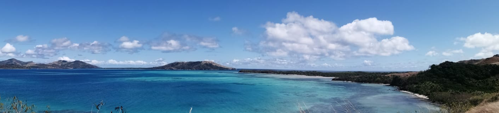

# Week 11: Tropical Ireland

Hard to believe, maybe, but Ireland used to be tropical - and the evidence from the rocks is all around us here in Limerick. We'll talk about that, and the formation of Europe, and why that's been particularly good for Ireland's tourism industry.

This section will contain lecture slides, the laboratory worksheet, and the assigned reading for the week.

## Reading

I would like you to read Chapter 19 of Lutgens and Tarbuck 2015 *Essentials of Geology* (available as an e-book, top of the reading list - see the link in the sidebar). This is the chapter on the evolution of the Earth through time; it will give a more global overview of what we're covering in this section of the module, and it also gives a nice overview of life through time which will help to understand the fossil content from this week's lecture.

I would also like you to read Chapters 8-11 of [Understanding Earth Processes Rocks and the Geology of Ireland](https://gsi.ie/documents/UnderstandingEarth_bookmarked.pdf) by Sleeman et al. These are the chapters on Ireland in the Carboniferous, Permian, and Triassic Periods, and so will more directly expand on what we cover in the lecture.

## For this week

 - Attend the lecture
 - Read Chapter 19 of Lutgens, F.K. and Tarbuck, E.J. 2015 Essentials of Geology. Pearson, Boston
 - Read Chapters 8-11 of Sleeman *et al.*
 - Labs TBC

## Lecture

Lecture slides: [GY4051 L11 Tropical](./assets/lectures/GY4051_L11_Tropical.pdf)

## Labs

TBC

## Additional

If you would like to explore the topic of radon a little more, I recommend this paper by [Elío et al. (2017)](https://www.sciencedirect.com/science/article/pii/S0048969717311713), describing the research which produced the new radon risk map for Ireland. The new map (used in the lecture) accounts for rock type, rock porosity and permeability, unconsolidated sediments, and soils - i.e. considering not just the source of the radon, but how it can get to the surface, especially via water.
