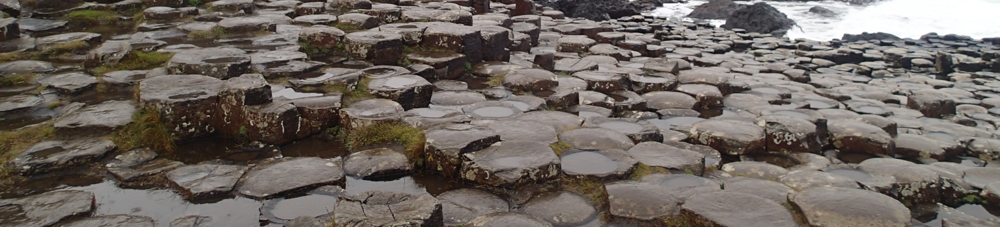

# Week 12: Recent Ireland

In our last lecture, we'll finish the story of how Ireland formed, taking us through the time of the....well, you'll find out...all the way through the Ice Ages to the present day. We'll also try to bring together some of the threads we've been considering throughout the lectures, answering some questions we asked right back at the start of the first lecture. In the lab, we'll look at some maps.

This section will contain lecture slides and the assigned reading for the week. There's also a mini-virtual field trip to the coast of Co. Antrim in a separate sub-page in the sidebar.

## Reading

I would like you to read Chapter 15 of Lutgens and Tarbuck 2015 *Essentials of Geology* (available as an e-book, top of the reading list - see the link in the sidebar).  This is the chapter on Glaciers and Glaciation, and it will help you to understand the ice ages which shaped modern Ireland.

An alternative might be [Chapter 19 Glacial Systems](https://geo.libretexts.org/Bookshelves/Geography_(Physical)/The_Physical_Environment_(Ritter)/19%3A_Glacial_Systems) of Ritter's The Physical Environment, available as a free eBook. 

I would also like you to read Chapters 12-16 of [Understanding Earth Processes Rocks and the Geology of Ireland](https://gsi.ie/documents/UnderstandingEarth_bookmarked.pdf) by Sleeman et al. These are the chapters on Ireland from the Jurassic to the Quaternary, and so will more directly expand on what we cover in the lecture.

In the lecture (and the mini-virtual field trip), I discussed geoengineering of roads, particularly the A2 coast road in Co. Antrim, and I would like you to read the attached paper by [Hughes et al.](./assets/papers/Hughes_13_Antrim_Coast_Road_Geoengineering.pdf) to reinforce this. The paper goes into some detail on monitoring methods - you don't need to understand these completely, although I'd like you to get from that at least a taste of what's involved in dealing with rock instability of this kind. However, the main point of me asking you to read this article is to better understand how the geology of the area makes geoengineering more difficult.

## For this week

 - Attend the lecture
 - Read Chapter 15 of Lutgens, F.K. and Tarbuck, E.J. 2015 Essentials of Geology
 - Read Chapters 8-11 of Sleeman *et al.*
 - Read the paper by Hughes *et al.* 2013
 - Mini-virtual field trip to the Antrim Coast

## Lecture

Lecture slides: [GY4051 L12 Recent Ireland](./assets/lectures/GY4051_L12_Recent_Ireland.pdf)

## Additional

The report identifying Co. Down as a potential location for a High Strength Rock (HSR) Geological Disposal Facility (GDF) for spent nuclear fuel can be found [here](https://www.gov.uk/guidance/northern-ireland-sub-region-2).
