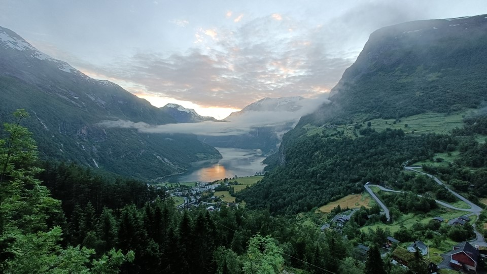

# Week 13: Virtual Field Trip to Geirangerfjord

Week 13 is Reading Week, and we'll finish the module with one more virtual field trip, this time to Geirangerfjord in Norway.

Like the previous virtual field trip to Parys, this will take the form of a series of videos recorded at the location, taking you on a tour around it, with some additional photos, all geolocated on an ArcGIS StoryMap. The Geirangerfjord region has some big contrasts with Ireland, and many of the differences in society between here and Ireland are due to the geology of the rocks around and underneath (and sometimes above) them, and the history of how those rocks came to be the way they are.

## Virtual Field Trip
Virtual Field Trip: [Virtual Field Trip to Parys Mine](https://storymaps.arcgis.com/stories/0fdfb00d838646ef9018a9314817c7fc)

## For this week

 - Do the virtual field trip

