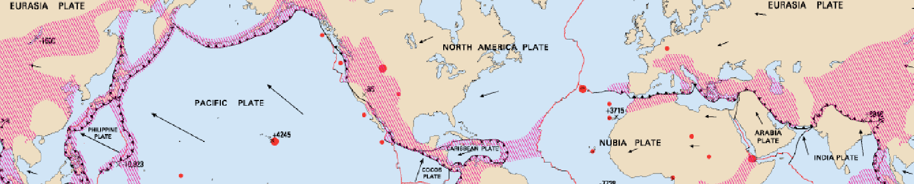

# Week 2: Plate Tectonics

During this week, we will build on our look at the formation of the Earth by considering the fundamental process of plate tectonics, the primary driver shaping our planet.

This section will contain lecture slides and the assigned reading for the week.

## Reading

I would like you to read Chapters 2-3 of Lutgens and Tarbuck 2015 *Essentials of Geology* (available as an e-book, top of the reading list - see the link in the sidebar). Chapter 2 is the chapter on Plate Tectonics, which will help you understand this week's lecture; Chapter 3 is the chapter on Matter and Minerals, which will be invaluable to better understand the specimens you'll be examining in the labs starting next week. 

An alternative is [Chapter Two](https://opengeology.org/textbook/2-plate-tectonics/) and [Chapter Three](https://opengeology.org/textbook/3-minerals/) of Johnson, C., Affolter, M.D., Inkenbrandt, P., and Mosher, C. (2017) An Introduction to Geology. USA: Salt Lake Community College. Chapter 2 is the chapter on Plate Tectonics, and Chapter 3 is the chapter on Minerals. 

## For this week

 - Attend the lecture
 - Read Chapters 2-3 of Lutgens, F.K. and Tarbuck, E.J. 2015 Essentials of Geology. Pearson, Boston
 - Labs TBC

## Lecture

Lecture slides: [GY4051 L2 Plate Tectonics](./assets/lectures/GY4051_L2_Plate_Tectonics.pdf)

## Labs

Laboratory Workbook: [Laboratory Workbook](./assets/labs/GY4051_Lab_Workbook.pdf)
Tables in Excel format: [Laboratory Exercise Tables](./assets/labs/GY4051_Lab_Tables.xlsx)

Geologic Time Scale online (copy in workbook): [Geologic Time Scale](https://stratigraphy.org/chart/)

Geological map of Ireland: [Geological Survey of Ireland mapviewer](https://dcenr.maps.arcgis.com/apps/MapSeries/index.html?appid=a30af518e87a4c0ab2fbde2aaac3c228)