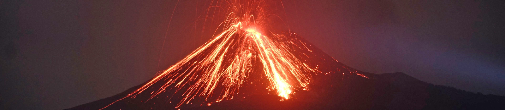

# Week 3: Volcanoes

During this week, we will look at how plate tectonics results in volcanoes and igneous systems, the rocks which form from them, and some of the impacts these have on society.

This section will contain lecture slides, the laboratory worksheet, and the assigned reading for the week.

## Reading

I would like you to read Chapters 4-5 of Lutgens and Tarbuck 2015 *Essentials of Geology* (available as an e-book, top of the reading list - see the link in the sidebar). Chapter 4 is the chapter on Igneous rocks and Intrusive activity, which will help you understand the first part of the lecture, and the intrusive rocks you'll see in the lab; Chapter 5 is the chapter on Volcanoes and Volcanic Hazards, which will help you understand the second half of the lecture, and the volcanic rocks you'll see in the lab. I highly recommend reading these before the labs, which will be much easier if you do.

An alternative is [Chapter Four](https://opengeology.org/textbook/4-igneous-processes-and-volcanoes/) of Johnson, C., Affolter, M.D., Inkenbrandt, P., and Mosher, C. (2017) An Introduction to Geology. USA: Salt Lake Community College. This is the chapter on Igneous Processes and Volcanoes.

## For this week

 - Attend the lecture
 - Read Chapters 2-3 of Lutgens, F.K. and Tarbuck, E.J. 2015 Essentials of Geology. Pearson, Boston
 - Labs TBC

## Lecture

Lecture slides: [GY4051 L3 Volcanoes](./assets/lectures/GY4051_L3_Volcanoes.pdf)

## Labs

Laboratory Workbook: [Laboratory Workbook](./assets/labs/GY4051_Lab_Workbook.pdf)

Tables and Questions in Word format: [Laboratory Exercise Questions Tables](./assets/labs/GY4051_Lab_Tables_Questions.docx)

Tables in Excel format: [Laboratory Exercise Tables](./assets/labs/GY4051_Lab_Tables.xlsx)

Geologic Time Scale online (copy in workbook): [Geologic Time Scale](https://stratigraphy.org/chart/)

Geological map of Ireland: [Geological Survey of Ireland mapviewer](https://dcenr.maps.arcgis.com/apps/MapSeries/index.html?appid=a30af518e87a4c0ab2fbde2aaac3c228)

## Additional

There are <a rel="noopener" href="https://www.volcanodiscovery.com/volcanoes/today.html">several volcanoes worldwide erupting today</a>. That's a really good website, if anyone wants to have a look at what's going on with volcanoes right now.

I said there were some good videos of erupting volcanoes on YouTube. <a rel="noopener" href="https://youtu.be/L4qDgsyFw7M?si=SKUQlejE4jBfCNCJ" title="BBC's Planet Earth with David Attenborough">BBC's Planet Earth with David Attenborough</a> has some amazing footage of Kilauea erupting in Hawai'i, and Hawai'ian eruptions of basalt can also be seen in this stunning <a rel="noopener" href="https://youtu.be/DQx96G4yHd8?si=pAmFCHZHJ0PpEKU3" title="drone footage from Iceland">drone footage from Iceland</a>. Strombolian eruptions can be seen in <a rel="noopener" href="https://youtu.be/pWeqbhCeZho?si=zheuwCZ5wtMyx9U0" title="Drone footage from Stromboli">drone footage from Stromboli</a> with super dramatic music but some incredible views. A <a rel="noopener" href="https://youtu.be/BUREX8aFbMs?si=sEc64AH1QKtFa9HF" title="Vulcanian eruption in New Guinea">Vulcanian eruption in New Guinea</a> was captured from a boat - <em>volume up</em>, but watch out - the shockwave is loud. This is <a rel="noopener" href="https://youtu.be/rKH9mxYF3qI?si=SlRmQKCs4hzWDnC_" title="a lava dome growing at the Soufriere volcano">a lava dome growing at the Soufriere volcano</a> in St. Vincent; and here's what happens when a lava dome collapses - <a rel="noopener" href="https://www.youtube.com/watch?v=TkdGe7AVPnE" title="a pyroclastic flow at Mt. Unzen in Japan">a pyroclastic flow at Mt. Unzen in Japan</a>, in 1991. Here's <a rel="noopener" href="https://youtu.be/OFgbbquApvY?si=kMX1OIZkWdX1BzKE" title="a pyroclastic flow carving down the side of a volcano in Indonesia">another pyroclastic flow carving down the side of a volcano in Indonesia</a>, and <a rel="noopener" href="https://www.youtube.com/watch?v=-kewaYtlhWo" title="a pyroclastic flow caught on CCTV">here's one caught on CCTV</a>. The largest, Plinian eruptions caught on film are much rarer - like the eruptions themselves - but here's part of an Italian documentary with <a rel="noopener" href="https://www.youtube.com/watch?v=SBLZADwyPPc" title="some footage from Pinatubo">some footage from Pinatubo</a> in Indonesia.

Here's a link to a video about the story of a Boeing 747 which lost all four engines due to flying into volcanic ash. <a rel="noopener" href="https://youtu.be/YYwN1R8hVsI?si=wYxUVmwTnWEkBMhH" title="This video">This video</a> is by a pilot, so it's more about the aviation than the volcano, but it's a great video. He also has an older one on <a rel="noopener" href="https://youtu.be/ahKoeqPXD-I?si=9vipb9AQfb8t4p-q" title="volcanic ash and aviation in general">volcanic ash and aviation in general</a>.

