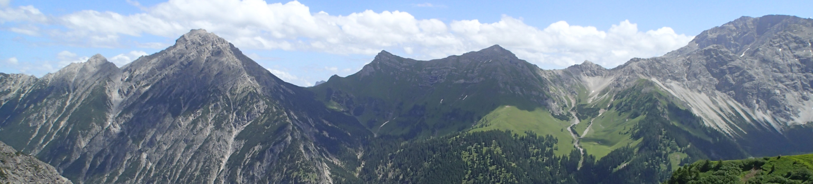

# Week 4: Metamorphism

During this week, we will explore how plate tectonics leads to the formation of metamorphic rocks, through the increased pressures and/or temperatures of continental collisions, subduction zones, and igneous intrusions, and think about how these rocks have impacted society, particularly with regards to water.

This section will contain lecture slides, the laboratory worksheet, and the assigned reading for the week.

## Reading

I would like you to read Chapter 8 of Lutgens and Tarbuck 2015 *Essentials of Geology* (available as an e-book, top of the reading list - see the link in the sidebar). This is the chapter on Metamorphism and Metamorphic Rocks, which will be invaluable for this week's content.

An alternative is [Chapter Six](https://opengeology.org/textbook/6-metamorphic-rocks/) of Johnson, C., Affolter, M.D., Inkenbrandt, P., and Mosher, C. (2017) An Introduction to Geology. USA: Salt Lake Community College. This is likewise the chapter on Metamorphism and Metamorphic rocks.

I would also like you to read [Price, W.R. and Ronck, C.L. 2019. Quarrying for World Heritage Designation: Slate Tourism in North Wales. Geoheritage 11, 1839–1854](https://link.springer.com/article/10.1007/s12371-019-00402-0). This paper explores some of the impacts of metamorphism on society in Wales, specifically the Welsh slate industry. It covers the history, the rocks, and modern tourism associated with the metamorphic slate in Wales. It is an interesting example of what I'm trying to get across in this module, understanding how the rocks and the geological history have impacted society through human history into the present day.

## For this week

 - Attend the lecture
 - Read Chapter 8 of Lutgens, F.K. and Tarbuck, E.J. 2015 Essentials of Geology. Pearson, Boston
 - Read the paper by Price and Ronck, 2019
 - Labs TBC

## Lecture

Lecture slides: [GY4051 L4 Metamorphism](./assets/lectures/GY4051_L4_Metamorphism.pdf)

## Labs

Laboratory Workbook: [Laboratory Workbook](./assets/labs/GY4051_Lab_Workbook.pdf)

Tables and Questions in Word format: [Laboratory Exercise Questions Tables](./assets/labs/GY4051_Lab_Tables_Questions.docx)

Tables in Excel format: [Laboratory Exercise Tables](./assets/labs/GY4051_Lab_Tables.xlsx)

Geologic Time Scale online (copy in workbook): [Geologic Time Scale](https://stratigraphy.org/chart/)

Geological map of Ireland: [Geological Survey of Ireland mapviewer](https://dcenr.maps.arcgis.com/apps/MapSeries/index.html?appid=a30af518e87a4c0ab2fbde2aaac3c228)

## Additional

To understand more about the minerals which rocks are made of, I'd suggest reading Chapter 3 of Lutgens, F.K. and Tarbuck, E.J. 2015&nbsp;<em>Essentials of Geology </em>(Matter and Minerals), or the alternative <a rel="noopener" href="https://opengeology.org/textbook/3-minerals/" target="_blank">Chapter 3</a> of Johnson, C., Affolter, M.D., Inkenbrandt, P., and Mosher, C. (2017) <em>An Introduction to Geology</em>. Both would be very useful reading - but, bear in mind that both go well beyond what you need.

The only part which might help is understanding the logic of the mineral structures - single tetrahedra, single chains, double chains, sheets, frameworks - with the singles, chains, and sheets held together by electrical charge. Just so that it makes a bit more sense when I mention minerals in other lectures - hopefully it with some of the metamorphism and volcanic/igneous parts mentioning minerals, and it will likely be helpful again when we discuss weathering and mining. You wouldn't need to know the mineral groups and properties etc.&nbsp;

There's alternatives with less of the material you don't need in <a rel="noopener" href="https://environmental-geol.pressbooks.tru.ca/chapter/minerals/" target="_self">Chapter 2.1 of Environmental Geology</a> by Steve Earle, and <a rel="noopener" href="https://opentextbc.ca/physicalgeologyh5p/chapter/silicate-minerals/" target="_self">Chapter 5.4 of Physical Geology</a> by Karla Panchuk (both online ebooks).

And here's a <a rel="noopener" href="https://www.gondwanatalks.com/l/asbestos-origin-geology/" target="_blank">blog post about asbestos</a>.

