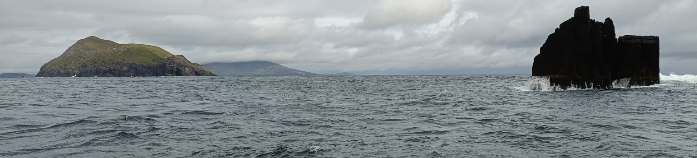

# Week 5: Erosion, transport, and deposition

During this week, we will look at how processes like wind and waves on the surface of the Earth lead to the erosion of mountains, and the transport and deposition of sediments. We'll look at some sedimentary rocks, and think about how they have influenced society, particularly looking at how coal, oil, and gas are formed and extracted from these types of rocks.

This section will contain lecture slides, the laboratory worksheet, and the assigned reading for the week.

## Reading

I would like you to read Chapters 6-7 of Lutgens and Tarbuck 2015 *Essentials of Geology* (available as an e-book, top of the reading list - see the link in the sidebar). These are the chapters on weathering and sedimentary rocks. 

An alternative is [Chapter Five](https://opengeology.org/textbook/5-weathering-erosion-and-sedimentary-rocks/) of Johnson, C., Affolter, M.D., Inkenbrandt, P., and Mosher, C. (2017) An Introduction to Geology. USA: Salt Lake Community College. This is likewise the chapter on Weathering, Erosion, and Sedimentary Rocks.

I would also like you to read a short paper on how sedimentary rocks have influenced society. While in the lecture my theme for this was oil and gas, there are many other ways in which clastic sedimentary rocks have been important throughout history, and this week's paper is about one example you probably wouldn't have thought of: [Colfer, N. 2019. Turning Stone into Bread: The Millstone Quarries of Medieval and Post-medieval Ireland. Industrial Archaeology Review 41, 65-72](https://www.tandfonline.com/doi/full/10.1080/03090728.2019.1594063).

## For this week

 - Attend the lecture
 - Read Chapters 6-7 of Lutgens, F.K. and Tarbuck, E.J. 2015 Essentials of Geology. Pearson, Boston
 - Read the paper by Colfer, 2019
 - Labs TBC

## Lecture

Lecture slides: [GY4051 L5 Erosion transport and deposition](./assets/lectures/GY4051_L5_Erosion_transport_deposition.pdf)

## Labs

Laboratory Workbook: [Laboratory Workbook](./assets/labs/GY4051_Lab_Workbook.pdf)
Tables in Excel format: [Laboratory Exercise Tables](./assets/labs/GY4051_Lab_Tables.xlsx)

Geologic Time Scale online (copy in workbook): [Geologic Time Scale](https://stratigraphy.org/chart/)

Geological map of Ireland: [Geological Survey of Ireland mapviewer](https://dcenr.maps.arcgis.com/apps/MapSeries/index.html?appid=a30af518e87a4c0ab2fbde2aaac3c228)

