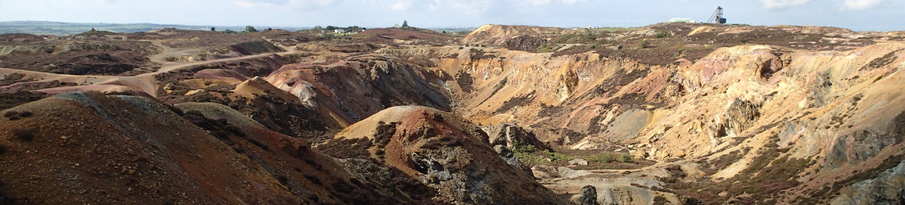

# Week 6: Virtual Field Trip to Parys Mine

Week 6 is Geography Reading Week, with no scheduled lectures. Instead, this week, you will take a virtual field trip to Parys Mine in Anglesey, Wales.

This section will contain a link to the virtual field trip, and the assigned reading for the week.

## Virtual Field Trip
Virtual Field Trip: [Virtual Field Trip to Parys Mine](https://storymaps.arcgis.com/stories/e3ef79b5c28c4e9fb7e78d7c37bdab45)

## Reading

I would like you to read [Chapter 16](https://opengeology.org/textbook/16-energy-and-mineral-resources/) of Johnson, C., Affolter, M.D., Inkenbrandt, P., and Mosher, C. (2017) An Introduction to Geology. USA: Salt Lake Community College. This is the chapter on Energy and Mineral Resources, and will help you to understand Parys mine. 

There is much more information about Parys Mine online: I suggest the website of the Anglesey Underground group, which has a lot of information about the history, industry, and people as well as the mine itself: [https://www.parysmountain.co.uk/](https://www.parysmountain.co.uk/)

## For this week

 - Read Chapter 16 of Johnson *et al.* 2017 An Introduction to Geology
 - Do the virtual field trip
 - Do the Reading Week lab exercise

## Labs

Laboratory Workbook: [Laboratory Workbook](./assets/labs/GY4051_Lab_Workbook.pdf)

Tables and Questions in Word format: [Laboratory Exercise Questions Tables](./assets/labs/GY4051_Lab_Tables_Questions.docx)

Geologic Time Scale online (copy in workbook): [Geologic Time Scale](https://stratigraphy.org/chart/)

