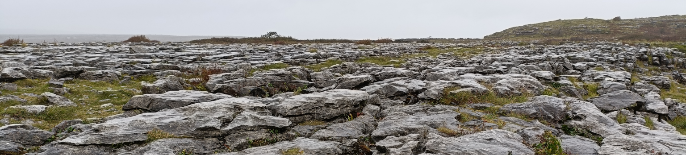

# Week 7: Carbonates

During this week, we will contrast last week's clastic sediments with a different type of sedimentary rock called carbonates - including their impacts on society in terms of water and fossil fuels.

This section will contain lecture slides, the laboratory worksheet, and the assigned reading for the week.

## Reading

I would like you to read Chapter 17 of Lutgens and Tarbuck 2015 *Essentials of Geology* (available as an e-book, top of the reading list - see the link in the sidebar). This is the chapter on shorelines. It does not cover carbonates specifically, but rather it covers some important background to shorelines in general, complementing the content from both this week and last week. You can skip the section on hurricanes.

## For this week

 - Attend the lecture
 - Read Chapter 17 of Lutgens, F.K. and Tarbuck, E.J. 2015 Essentials of Geology. Pearson, Boston
 - Labs TBC

## Lecture

Lecture slides: [GY4051 L7 Carbonates](./assets/lectures/GY4051_L7_Carbonates.pdf)

## Labs

Laboratory Workbook: [Laboratory Workbook](./assets/labs/GY4051_Lab_Workbook.pdf)

Tables and Questions in Word format: [Laboratory Exercise Questions Tables](./assets/labs/GY4051_Lab_Tables_Questions.docx)

Tables in Excel format: [Laboratory Exercise Tables](./assets/labs/GY4051_Lab_Tables.xlsx)

Geologic Time Scale online (copy in workbook): [Geologic Time Scale](https://stratigraphy.org/chart/)

Geological map of Ireland: [Geological Survey of Ireland mapviewer](https://dcenr.maps.arcgis.com/apps/MapSeries/index.html?appid=a30af518e87a4c0ab2fbde2aaac3c228)

