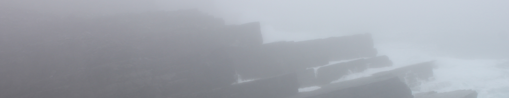

# Week 9: Laurentia, Avalonia, and the Iapetus Ocean

Now that we've covered all the main types of rocks, looking at how they form and some of the ways they've influenced society, it's time to think about how all those types of rock come together to form particular places. And what better place to consider than our own island of Ireland. During this week, we will look at how Ireland used to be part of not one but two different continents, called Laurentia and Avalonia, separated by an ocean called Iapetus. We'll cover what happened to those continents and that ocean, and how those events have had lasting impacts that still influence Irish society today.

This section will contain lecture slides, the laboratory worksheet, and the assigned reading for the week.

## Reading

I would like you to read Chapter 10 of Lutgens and Tarbuck 2015 *Essentials of Geology* (available as an e-book, top of the reading list - see the link in the sidebar). This is the chapter on the origin and evolution of the ocean floor, and it will help you to understand what was happening during the events described in the lecture.

I would also like you to read Chapters 2-4 of [Understanding Earth Processes Rocks and the Geology of Ireland](https://gsi.ie/documents/UnderstandingEarth_bookmarked.pdf) by Sleeman et al. These cover the Precambrian to Silurian, and will more directly expand on what we cover in the lecture.

I would also like you to read a short paper on how mining influenced society. The virtual field trip during reading week looked at Parys mine in Wales - at the same time, we had copper mining in Waterford. [Cowman, D. 1983 Life and Labour in Three Irish Mining Communities circa 1840. Saothar 9, 10-19](https://www.jstor.org/stable/23193860)

## For this week

 - Attend the lecture
 - Read Chapter 10 of Lutgens, F.K. and Tarbuck, E.J. 2015 Essentials of Geology. Pearson, Boston
 - Read Chapters 2-4 of Sleeman *et al.*
 - Read the paper by Cowman, 1983
 - Labs TBC

## Lecture

Lecture slides: [GY4051 L9 Laurentia, Avalonia, and Iapetus](./assets/lectures/GY4051_L9_Laurentia_Avalonia_Iapetus.pdf)

## Labs

Laboratory Workbook: [Laboratory Workbook](./assets/labs/GY4051_Lab_Workbook.pdf)

Tables and Questions in Word format: [Laboratory Exercise Questions Tables](./assets/labs/GY4051_Lab_Tables_Questions.docx)

Tables in Excel format: [Laboratory Exercise Tables](./assets/labs/GY4051_Lab_Tables.xlsx)

Geologic Time Scale online (copy in workbook): [Geologic Time Scale](https://stratigraphy.org/chart/)

Geological map of Ireland: [Geological Survey of Ireland mapviewer](https://dcenr.maps.arcgis.com/apps/MapSeries/index.html?appid=a30af518e87a4c0ab2fbde2aaac3c228)

## Additional

Here's a YouTube short showing some metamorphic rocks on Mull, in Scotland: [The geology of Mull - Ardlanish Beach](https://www.youtube.com/watch?v=dpsiJPRnW00)

## 3D rock outcrops

### Schist - Cushendun, Co. Antrim

 <iframe title="Glendun Formation schist, Cushendun" frameborder="0" allowfullscreen mozallowfullscreen="true" webkitallowfullscreen="true" allow="autoplay; fullscreen; xr-spatial-tracking" xr-spatial-tracking execution-while-out-of-viewport execution-while-not-rendered web-share src="https://sketchfab.com/models/82356e2ae9cb4bf99bc05837144c9073/embed"> </iframe> 
 <a href="https://sketchfab.com/3d-models/glendun-formation-schist-cushendun-82356e2ae9cb4bf99bc05837144c9073?utm_medium=embed&utm_campaign=share-popup&utm_content=82356e2ae9cb4bf99bc05837144c9073" target="_blank" rel="nofollow" style="font-weight: bold; color: #1CAAD9;"> Glendun Formation schist, Cushendun </a> by <a href="https://sketchfab.com/bamacgabhann?utm_medium=embed&utm_campaign=share-popup&utm_content=82356e2ae9cb4bf99bc05837144c9073" target="_blank" rel="nofollow" style="font-weight: bold; color: #1CAAD9;"> Dr. Breandán Anraoi MacGabhann </a> on <a href="https://sketchfab.com?utm_medium=embed&utm_campaign=share-popup&utm_content=82356e2ae9cb4bf99bc05837144c9073" target="_blank" rel="nofollow" style="font-weight: bold; color: #1CAAD9;">Sketchfab</a>

